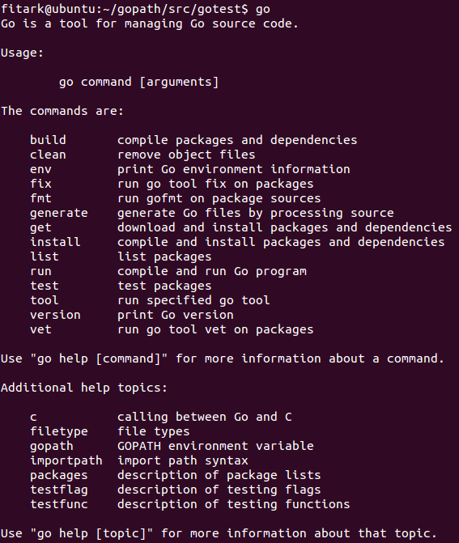

# 1.1 使用源码安装Go

这里我们介绍在Ubuntu下使用源码安装Go的过程。

首先需要安装一些必要的工具  

	$sudo apt-get update  
	$sudo apt-get -y install mercurial bison gcc libc6-dev ed gawk make git  
	$sudo apt-get upgrade  

然后可以在/etc/profile里面添加相关环境变量

	$sudo gedit /etc/profile

如下
	
	export GOROOT=$HOME/tools/go
	export GOBIN=$GOROOT/bin
	export GOARCH=amd64          注意：arm 平台上请修改为arm
	export GOOS=linux
	export PATH=$GOBIN:$PATH
	export GOPATH=$HOME/gopath

然后执行如下代码使得变量生效

	$source   /etc/profile

在go语言[主页](http://golang.org/dl/)下载[源码](https://storage.googleapis.com/golang/go1.4.2.src.tar.gz)后解压形成/home/fitark/go目录，然后执行如下指令进行编译

	$cd $GOROOT/src
	$./all.bash

运行all.bash后出现"ALL TESTS PASSED"字样时才算成功。

源码安装之后执行Go命令，看到如下图片即说明你已经安装成功

图1.1 源码安装之后执行Go命令的图

这是我们可以测试一下是否安装成功，在$GOPATH/src中建立test.go文件,并运行go run test.go,打印出hello world表示安装成功

	package main
	import(
  	  "fmt"
	)
	func main(){
  	  fmt.Println("hello world")
	}

## links
   * [目录](<preface.md>)
   * 上一节: [Go环境配置](<01.0.md>)
   * 下一节: [GOPATH 与工作空间](<01.2.md>)
