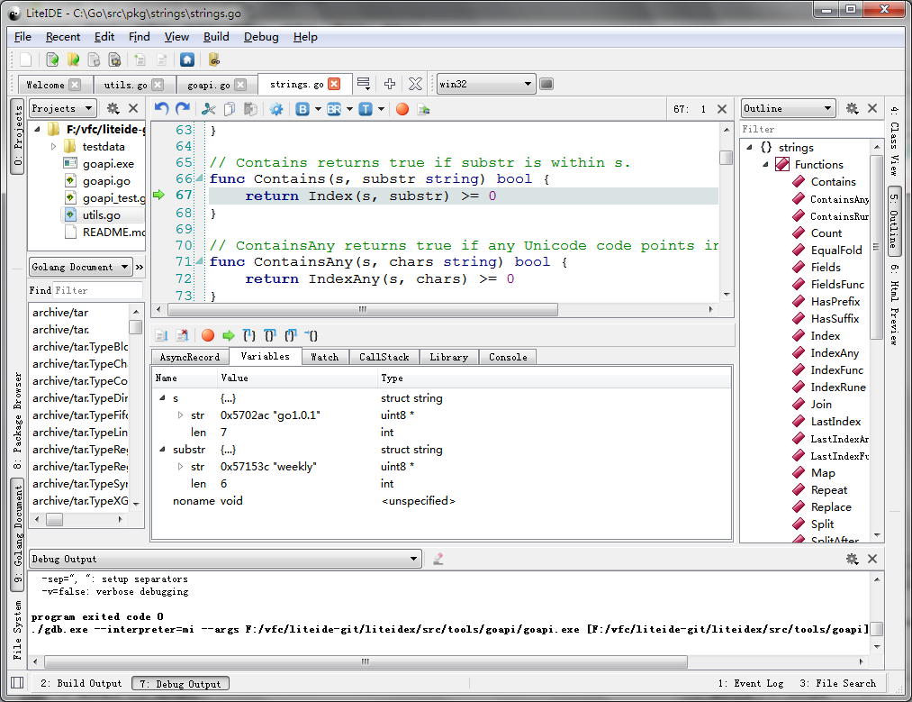
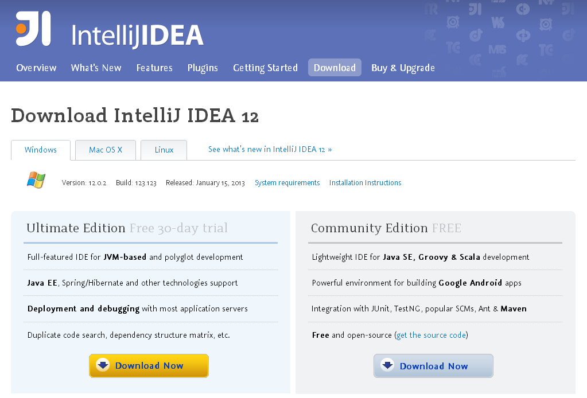
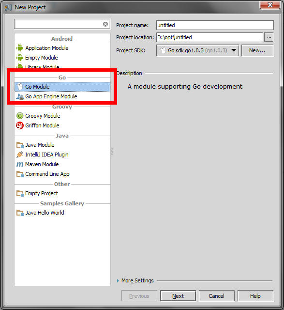

# 1.4 Go开发工具 - LiteIDE

本节我将介绍几个开发工具，它们都具有自动化提示，自动化fmt功能。因为它们都是跨平台的，所以安装步骤之类的都是通用的。

## LiteIDE

  LiteIDE是一款专门为Go语言开发的跨平台轻量级集成开发环境（IDE）。

  

图1.4 LiteIDE主界面

**LiteIDE主要特点：**

* 支持主流操作系统
	* Windows 
	* Linux 
	* MacOS X
* Go编译环境管理和切换
	* 管理和切换多个Go编译环境
	* 支持Go语言交叉编译
* 与Go标准一致的项目管理方式
	* 基于GOPATH的包浏览器
	* 基于GOPATH的编译系统
	* 基于GOPATH的Api文档检索
* Go语言的编辑支持
	* 类浏览器和大纲显示
	* Gocode(代码自动完成工具)的完美支持
	* Go语言文档查看和Api快速检索
	* 代码表达式信息显示`F1`
	* 源代码定义跳转支持`F2`
	* Gdb断点和调试支持
	* gofmt自动格式化支持
* 其他特征
	* 支持多国语言界面显示
	* 完全插件体系结构
	* 支持编辑器配色方案
	* 基于Kate的语法显示支持
	* 基于全文的单词自动完成
	* 支持键盘快捷键绑定方案
	* Markdown文档编辑支持
		* 实时预览和同步显示
		* 自定义CSS显示
		* 可导出HTML和PDF文档
		* 批量转换/合并为HTML/PDF文档

**LiteIDE安装配置**

* LiteIDE安装
	* 下载地址 <http://code.google.com/p/golangide>
	* 源码地址 <https://github.com/visualfc/liteide>
	
	首先安装好Go语言环境，然后根据操作系统下载LiteIDE对应的压缩文件直接解压即可使用。

* 安装Gocode

	启用Go语言的输入自动完成需要安装Gocode：
	
		go get -u github.com/nsf/gocode

* 编译环境设置

	根据自身系统要求切换和配置LiteIDE当前使用的环境变量。
	
	以Windows操作系统，64位Go语言为例，
	工具栏的环境配置中选择win64，点`编辑环境`，进入LiteIDE编辑win64.env文件
	
		GOROOT=c:\go
		GOBIN=
		GOARCH=amd64
		GOOS=windows
		CGO_ENABLED=1
		
		PATH=%GOBIN%;%GOROOT%\bin;%PATH%
		。。。
	
	将其中的`GOROOT=c:\go`修改为当前Go安装路径，存盘即可，如果有MinGW64，可以将`c:\MinGW64\bin`加入PATH中以便go调用gcc支持CGO编译。

	以Linux操作系统，64位Go语言为例，
	工具栏的环境配置中选择linux64，点`编辑环境`，进入LiteIDE编辑linux64.env文件
	
		GOROOT=$HOME/go
		GOBIN=
		GOARCH=amd64
		GOOS=linux
		CGO_ENABLED=1
		
		PATH=$GOBIN:$GOROOT/bin:$PATH	
		。。。
		
	将其中的`GOROOT=$HOME/go`修改为当前Go安装路径，存盘即可。

* GOPATH设置

	Go语言的工具链使用GOPATH设置，是Go语言开发的项目路径列表，在命令行中输入(在LiteIDE中也可以`Ctrl+,`直接输入)`go help gopath`快速查看GOPATH文档。
	
	在LiteIDE中可以方便的查看和设置GOPATH。通过`菜单－查看－GOPATH`设置，可以查看系统中已存在的GOPATH列表，
	同时可根据需要添加项目目录到自定义GOPATH列表中。

## IntelliJ IDEA
熟悉Java的读者应该对于idea不陌生，idea是通过一个插件来支持go语言的高亮语法,代码提示和重构实现。

1. 先下载idea，idea支持多平台：win,mac,linux，如果有钱就买个正式版，如果不行就使用社区免费版，对于只是开发Go语言来说免费版足够用了

	

2. 安装Go插件，点击菜单File中的Setting，找到Plugins,点击,Broswer repo按钮。国内的用户可能会报错，自己解决哈。

	

3. 这时候会看见很多插件，搜索找到Golang,双击,download and install。等到golang那一行后面出现Downloaded标志后,点OK。

	
	
	然后点 Apply .这时候IDE会要求你重启。
	
4. 	重启完毕后,创建新项目会发现已经可以创建golang项目了：

	

	下一步,会要求你输入 go sdk的位置,一般都安装在C:\Go，linux和mac根据自己的安装目录设置，选中目录确定,就可以了。

## links
   * [目录](<preface.md>)
   * 上一节: [Go 命令](<01.3.md>)
   * 下一节: [总结](<01.5.md>)
