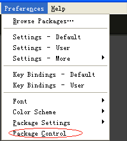
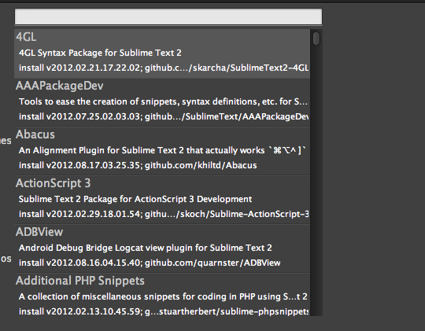

# 1.5 Go开发工具 - Sublime Text

目前可以使用Sublime Text3对于golang的支持还不太全面，所以默认使用Sublime Text 2+GoSublime+gocode+MarGo+GoGdb+SublimeGDB的组合，那么为什么选择这个组合呢？

  - 自动化提示代码

  - 保存的时候自动格式化代码，让您编写的代码更加美观，符合Go的标准。
  - 支持项目管理
	
  - 支持语法高亮
  - Sublime Text 2可免费使用，只是保存次数达到一定数量之后就会提示是否购买，点击取消继续用，和正式注册版本没有任何区别。

## 安装Sublime
  根据自己相应的系统下载相应的版本，然后打开Sublime，对于不熟悉Sublime的同学可以先看一下这篇文章[Sublime Text 2 入门及技巧](http://lucifr.com/139225/sublime-text-2-tricks-and-tips/)
  
  我们在ubuntu14.04下直接解压sublime2，形成目录/home/fitark/tools/sublime，该目录下的sublime_text就是一个可以运行的可执行程序。

## 启动快捷方式
   首先我们通过ln建立超链接，然后修改/usr/share/applications/subl.desktop这个文件，最后可以通过subl启动sublime，这时右击图标Lock到Launcher里面即可。

	$sudo ln -s /home/fitark/tools/sublime/sublime_text /usr/bin/subl
	$sudo gedit /usr/share/applications/subl.desktop

	#!/usr/bin/env xdg-open
	[Desktop Entry]
	Name=Sublime Text 2
	Comment=Sublime Text 2
	Exec=/home/fitark/tools/sublime/sublime_text
	Icon=/home/fitark/tools/sublime/Icon/48x48/sublime_text.png
	Terminal=false
	Type=Application
	Categories=Application;Development;
	StartupNotify=true

## 安装插件
打开之后安装 Package Control：Ctrl+` 打开命令行，执行如下代码：

		import urllib2,os; pf='Package Control.sublime-package'; ipp=sublime.installed_packages_path(); os.makedirs(ipp) if not os.path.exists(ipp) else None; urllib2.install_opener(urllib2.build_opener(urllib2.ProxyHandler())); open(os.path.join(ipp,pf),'wb').write(urllib2.urlopen('http://sublime.wbond.net/'+pf.replace(' ','%20')).read()); print 'Please restart Sublime Text to finish installation'

   这个时候重启一下Sublime，可以发现在在菜单栏多了一个如下的栏目，说明Package Control已经安装成功了。

  

图1.7 sublime包管理

安装完之后就可以安装Sublime的插件了。需安装GoSublime、SidebarEnhancements,Go Build,GoGDB, SublimeGDB ，安装插件之后记得重启Sublime生效，Ctrl+Shift+p打开Package Controll 输入`pcip`（即“Package Control: Install Package”的缩写）。  这个时候看左下角显示正在读取包数据，完成之后出现如下界面

  

图1.8 sublime安装插件界面

  这个时候输入GoSublime，按确定就开始安装了。同理应用于SidebarEnhancements和Go Build。

## 验证是否安装成功

你可以打开Sublime，打开main.go，看看语法是不是高亮了，输入`import`是不是自动化提示了，`import "fmt"`之后，输入`fmt.`是不是自动化提示有函数了。 如果已经出现这个提示，那说明你已经安装完成了，并且完成了自动提示。 如果没有出现这样的提示，一般就是你的`$PATH`没有配置正确。你可以打开终端，输入gocode，是不是能够正确运行，如果不行就说明`$PATH`没有配置正确。
  

## 配置GDB调试

注意编译程序

从菜单中打开 Perferences->Package Settings->GoGDB->Settings-Default ，会打开GoGDB的settings文件，修改 workingdir 为工程所在目录，修改 commandline 中executable为可执行文件名，就可以用进行调试了。按f9 设置断点，  F5启动调试界面。