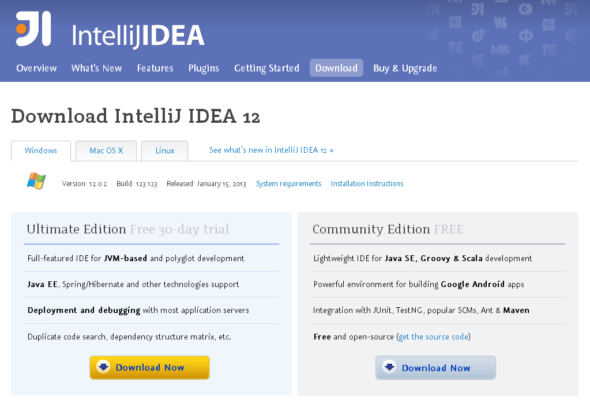
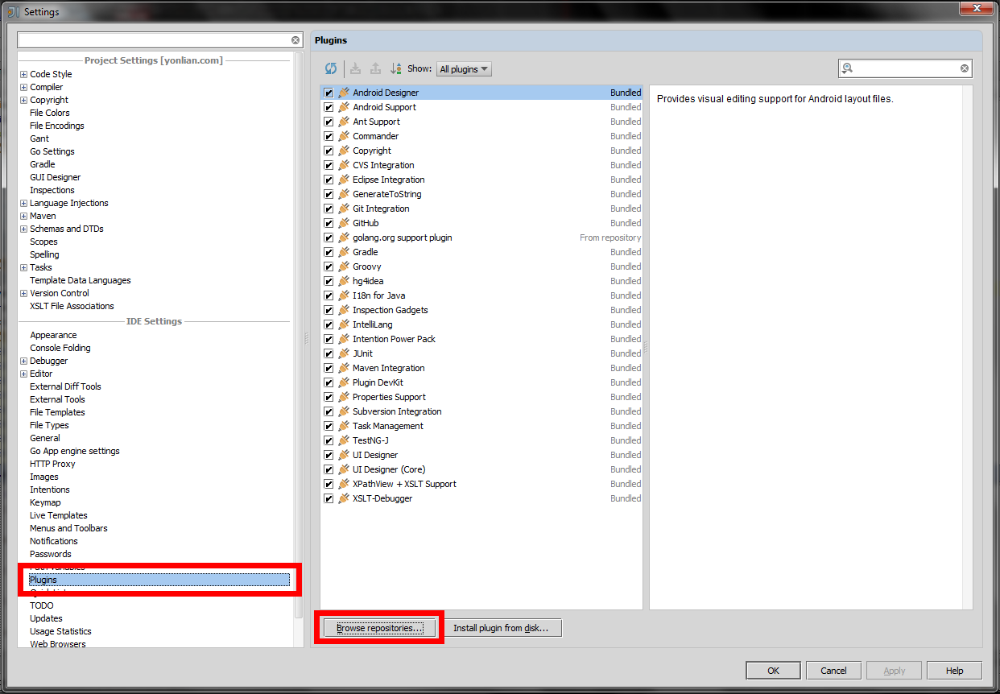
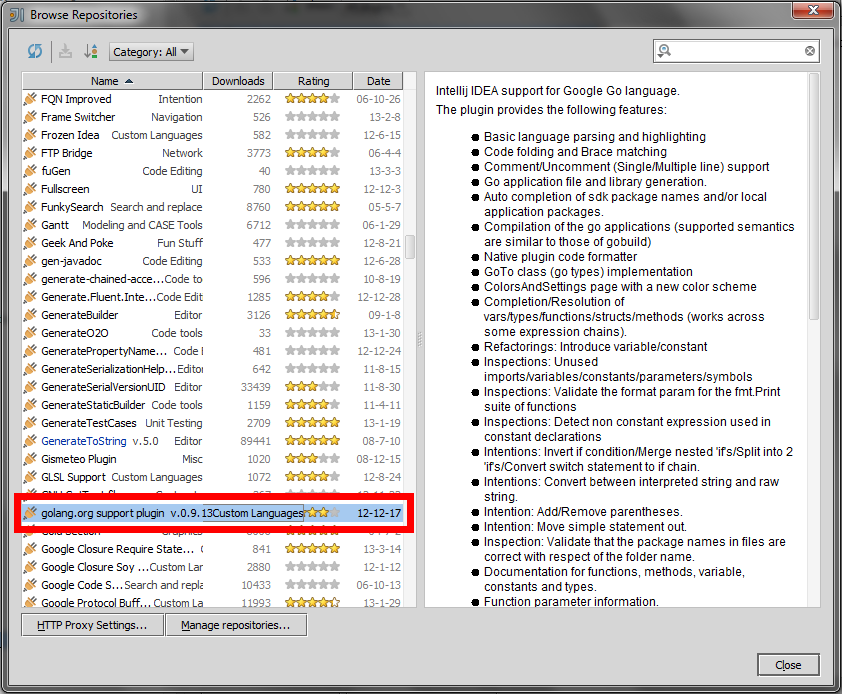
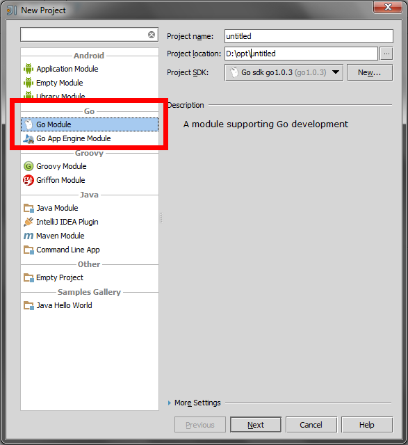

# 1.6 Go开发工具 - IntelliJ IDEA

熟悉Java的读者应该对于idea不陌生，idea是通过一个插件来支持go语言的高亮语法,代码提示和重构实现。

1. 先下载idea，idea支持多平台：win,mac,linux，如果有钱就买个正式版，如果不行就使用社区免费版，对于只是开发Go语言来说免费版足够用了

	

2. 安装Go插件，点击菜单File中的Setting，找到Plugins,点击,Broswer repo按钮。国内的用户可能会报错，自己解决哈。

	

3. 这时候会看见很多插件，搜索找到Golang,双击,download and install。等到golang那一行后面出现Downloaded标志后,点OK。

	
	
	然后点 Apply .这时候IDE会要求你重启。
	
4. 	重启完毕后,创建新项目会发现已经可以创建golang项目了：

	

	下一步,会要求你输入 go sdk的位置,一般都安装在C:\Go，linux和mac根据自己的安装目录设置，选中目录确定,就可以了。