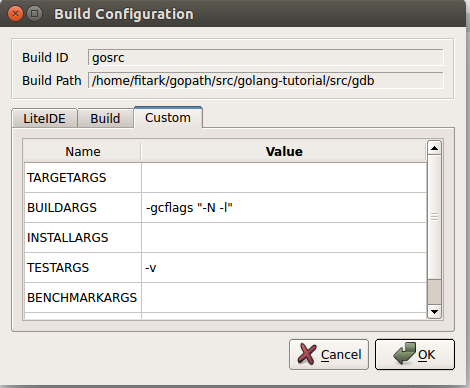
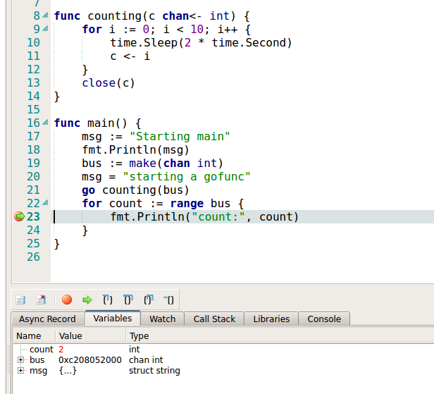

# 11.2 使用GDB调试

我们可以通过GDB来进行调试，GDB是UNIX系统下的程序调试工具。使用GDB可以做如下事情：

1. 启动程序，可以按照开发者的自定义要求运行程序。
2. 可让被调试的程序在开发者设定的调置的断点处停住。（断点可以是条件表达式）
3. 当程序被停住时，可以检查此时程序中所发生的事。
4. 动态的改变当前程序的执行环境。

目前支持调试Go程序的GDB版本必须大于7.1。

编译Go程序的时候需要注意以下几点

1. 传递参数-ldflags "-s"，忽略debug的打印信息
2. 传递-gcflags "-N -l" 参数，这样可以忽略Go内部做的一些优化，聚合变量和函数等优化，这样对于GDB调试来说非常困难，所以在编译的时候加入这两个参数避免这些优化。 

## 常用命令
GDB的一些常用命令如下所示

- list

	简写命令`l`，用来显示源代码，默认显示十行代码，后面可以带上参数显示的具体行，例如：`list 15`，显示十行代码，其中第15行在显示的十行里面的中间，如下所示。

		10	        time.Sleep(2 * time.Second)
		11	        c <- i
		12	    }
		13	    close(c)
		14	}
		15	
		16	func main() {
		17	    msg := "Starting main"
		18	    fmt.Println(msg)
		19	    bus := make(chan int)

	
- break

	简写命令 `b`,用来设置断点，后面跟上参数设置断点的行数，例如`b 10`在第十行设置断点。
	
- delete
	简写命令 `d`,用来删除断点，后面跟上断点设置的序号，这个序号可以通过`info breakpoints`获取相应的设置的断点序号，如下是显示的设置断点序号。

		Num     Type           Disp Enb Address            What
		2       breakpoint     keep y   0x0000000000400dc3 in main.main at /home/xiemengjun/gdb.go:23
		breakpoint already hit 1 time

- backtrace
	
	简写命令 `bt`,用来打印执行的代码过程，如下所示：

		#0  main.main () at /home/xiemengjun/gdb.go:23
		#1  0x000000000040d61e in runtime.main () at /home/xiemengjun/go/src/pkg/runtime/proc.c:244
		#2  0x000000000040d6c1 in schedunlock () at /home/xiemengjun/go/src/pkg/runtime/proc.c:267
		#3  0x0000000000000000 in ?? ()
- info

	info命令用来显示信息，后面有几种参数，我们常用的有如下几种：
		
	- `info locals`

		显示当前执行的程序中的变量值
	- `info breakpoints`

		显示当前设置的断点列表
	- `info goroutines`

		显示当前执行的goroutine列表，如下代码所示,带*的表示当前执行的

			* 1  running runtime.gosched
			* 2  syscall runtime.entersyscall
			  3  waiting runtime.gosched
			  4 runnable runtime.gosched
- print

	简写命令`p`，用来打印变量或者其他信息，后面跟上需要打印的变量名，当然还有一些很有用的函数$len()和$cap()，用来返回当前string、slices或者maps的长度和容量。

- whatis 
	
	用来显示当前变量的类型，后面跟上变量名，例如`whatis msg`,显示如下：

		type = struct string
- next

	简写命令 `n`,用来单步调试，跳到下一步，当有断点之后，可以输入`n`跳转到下一步继续执行
- coutinue

	简称命令 `c`，用来跳出当前断点处，后面可以跟参数N，跳过多少次断点

- set variable

	该命令用来改变运行过程中的变量值，格式如：`set variable <var>=<value>`

## 调试过程
我们通过下面这个代码来演示如何通过GDB来调试Go程序，下面是将要演示的代码：

	package main

	import (
		"fmt"
		"time"
	)

	func counting(c chan<- int) {
		for i := 0; i < 10; i++ {
			time.Sleep(2 * time.Second)
			c <- i
		}
		close(c)
	}

	func main() {
		msg := "Starting main"
		fmt.Println(msg)
		bus := make(chan int)
		msg = "starting a gofunc"
		go counting(bus)
		for count := range bus {
			fmt.Println("count:", count)
		}
	}

编译文件，生成可执行文件gdbfile:

	go build -gcflags "-N -l" gdbfile.go

通过gdb命令启动调试：

	gdb gdbfile
	
启动之后首先看看这个程序是不是可以运行起来，只要输入`run`命令回车后程序就开始运行，程序正常的话可以看到程序输出如下，和我们在命令行直接执行程序输出是一样的：

	(gdb) run
	Starting program: /home/xiemengjun/gdbfile 
	Starting main
	count: 0
	count: 1
	count: 2
	count: 3
	count: 4
	count: 5
	count: 6
	count: 7
	count: 8
	count: 9
	[LWP 2771 exited]
	[Inferior 1 (process 2771) exited normally]	
好了，现在我们已经知道怎么让程序跑起来了，接下来开始给代码设置断点：

	(gdb) b 23
	Breakpoint 1 at 0x400d8d: file /home/xiemengjun/gdbfile.go, line 23.
	(gdb) run
	Starting program: /home/xiemengjun/gdbfile 
	Starting main
	[New LWP 3284]
	[Switching to LWP 3284]

	Breakpoint 1, main.main () at /home/xiemengjun/gdbfile.go:23
	23	        fmt.Println("count:", count)

上面例子`b 23`表示在第23行设置了断点，之后输入`run`开始运行程序。现在程序在前面设置断点的地方停住了，我们需要查看断点相应上下文的源码，输入`list`就可以看到源码显示从当前停止行的前五行开始：

	(gdb) list
	18	    fmt.Println(msg)
	19	    bus := make(chan int)
	20	    msg = "starting a gofunc"
	21	    go counting(bus)
	22	    for count := range bus {
	23	        fmt.Println("count:", count)
	24	    }
	25	}

现在GDB在运行当前的程序的环境中已经保留了一些有用的调试信息，我们只需打印出相应的变量，查看相应变量的类型及值：

	(gdb) info locals
	count = 0
	bus = 0xf840001a50
	(gdb) p count
	$1 = 0
	(gdb) p bus
	$2 = (chan int) 0xf840001a50
	(gdb) whatis bus
	type = chan int

接下来该让程序继续往下执行，请继续看下面的命令

	(gdb) c
	Continuing.
	count: 0
	[New LWP 3303]
	[Switching to LWP 3303]

	Breakpoint 1, main.main () at /home/xiemengjun/gdbfile.go:23
	23 fmt.Println("count:", count)
	(gdb) c
	Continuing.
	count: 1
	[Switching to LWP 3302]

	Breakpoint 1, main.main () at /home/xiemengjun/gdbfile.go:23
	23 fmt.Println("count:", count)

每次输入`c`之后都会执行一次代码，又跳到下一次for循环，继续打印出来相应的信息。

设想目前需要改变上下文相关变量的信息，跳过一些过程，并继续执行下一步，得出修改后想要的结果：

	(gdb) info locals
	count = 2
	bus = 0xf840001a50
	(gdb) set variable count=9
	(gdb) info locals
	count = 9
	bus = 0xf840001a50
	(gdb) c
	Continuing.
	count: 9
	[Switching to LWP 3302]

	Breakpoint 1, main.main () at /home/xiemengjun/gdbfile.go:23
	23 fmt.Println("count:", count)		

##使用LiteIDE调试

更加方便的是使用IDE进行调试，不过需要做一些额外的设置，才可以顺利进行调试。

当我们使用LiteIDE进行调试时，需要设置-gcflags "-N -l" 参数，这个参数可以在如下设置里面添加
	
	Build -> Build Configuration... -> Custom -> BUILDARGS ->

具体如下图所示

调试效果是这样的

	
## 小结
本小节我们介绍了GDB调试Go程序的一些基本命令，包括`run`、`print`、`info`、`set variable`、`coutinue`、`list`、`break`	等经常用到的调试命令，通过上面的例子演示，我相信读者已经对于通过GDB调试Go程序有了基本的理解，如果你想获取更多的调试技巧请参考官方网站的GDB调试手册，还有GDB官方网站的手册。	
	
## links
   * [目录](<preface.md>)
   * 上一节: [错误处理](<11.1.md>)
   * 下一节: [Go怎么写测试用例](<11.3.md>)
