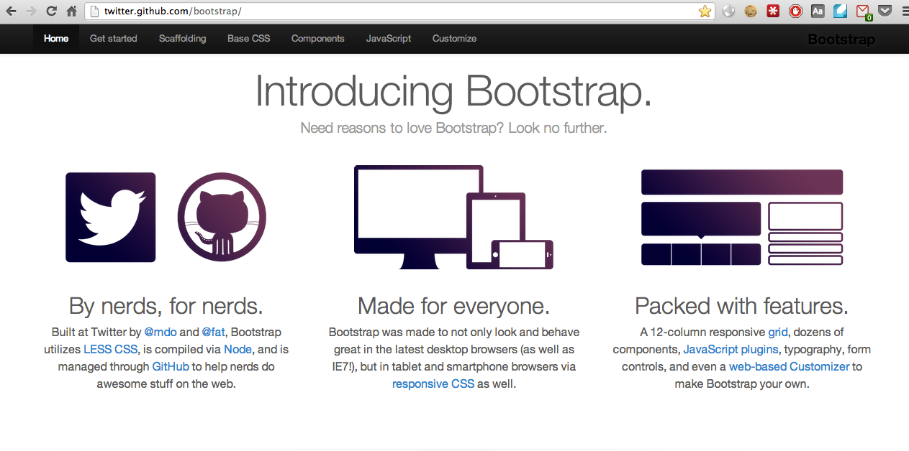
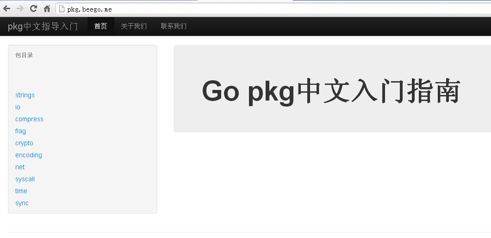

# 14.1 静态文件支持
我们在前面已经讲过如何处理静态文件，这小节我们详细的介绍如何在beego里面设置和使用静态文件。通过再介绍一个twitter开源的html、css框架bootstrap，无需大量的设计工作就能够让你快速地建立一个漂亮的站点。

## beego静态文件实现和设置
Go的net/http包中提供了静态文件的服务，`ServeFile`和`FileServer`等函数。beego的静态文件处理就是基于这一层处理的，具体的实现如下所示：

	//static file server
	for prefix, staticDir := range StaticDir {
		if strings.HasPrefix(r.URL.Path, prefix) {
			file := staticDir + r.URL.Path[len(prefix):]
			http.ServeFile(w, r, file)
			w.started = true
			return
		}
	}
	
StaticDir里面保存的是相应的url对应到静态文件所在的目录，因此在处理URL请求的时候只需要判断对应的请求地址是否包含静态处理开头的url，如果包含的话就采用http.ServeFile提供服务。

举例如下：

	beego.StaticDir["/asset"] = "/static"

那么请求url如`http://www.beego.me/asset/bootstrap.css`就会请求`/static/bootstrap.css`来提供反馈给客户端。	

## bootstrap集成
Bootstrap是Twitter推出的一个开源的用于前端开发的工具包。对于开发者来说，Bootstrap是快速开发Web应用程序的最佳前端工具包。它是一个CSS和HTML的集合，它使用了最新的HTML5标准，给你的Web开发提供了时尚的版式，表单，按钮，表格，网格系统等等。

- 组件
　　Bootstrap中包含了丰富的Web组件，根据这些组件，可以快速的搭建一个漂亮、功能完备的网站。其中包括以下组件：
　　下拉菜单、按钮组、按钮下拉菜单、导航、导航条、面包屑、分页、排版、缩略图、警告对话框、进度条、媒体对象等
- Javascript插件
　　Bootstrap自带了13个jQuery插件，这些插件为Bootstrap中的组件赋予了“生命”。其中包括：
　　模式对话框、标签页、滚动条、弹出框等。
- 定制自己的框架代码
　　可以对Bootstrap中所有的CSS变量进行修改，依据自己的需求裁剪代码。

图14.1 bootstrap站点

接下来我们利用bootstrap集成到beego框架里面来，快速的建立一个漂亮的站点。

1. 首先把下载的bootstrap目录放到我们的项目目录，取名为static，如下截图所示

	
	
	图14.2 项目中静态文件目录结构

2. 因为beego默认设置了StaticDir的值，所以如果你的静态文件目录是static的话就无须再增加了：

	StaticDir["/static"] = "static"
	
3. 模板中使用如下的地址就可以了：

		//css文件
		<link href="/static/css/bootstrap.css" rel="stylesheet">
		
		//js文件
		
		
		//图片文件
		

上面可以实现把bootstrap集成到beego中来，如下展示的图就是集成进来之后的展现效果图：

图14.3 构建的基于bootstrap的站点界面

这些模板和格式bootstrap官方都有提供，这边就不再重复贴代码，大家可以上bootstrap官方网站学习如何编写模板。

## links
   * [目录](<preface.md>)
   * 上一节: [扩展Web框架](<14.0.md>)
   * 下一节: [Session支持](<14.2.md>)