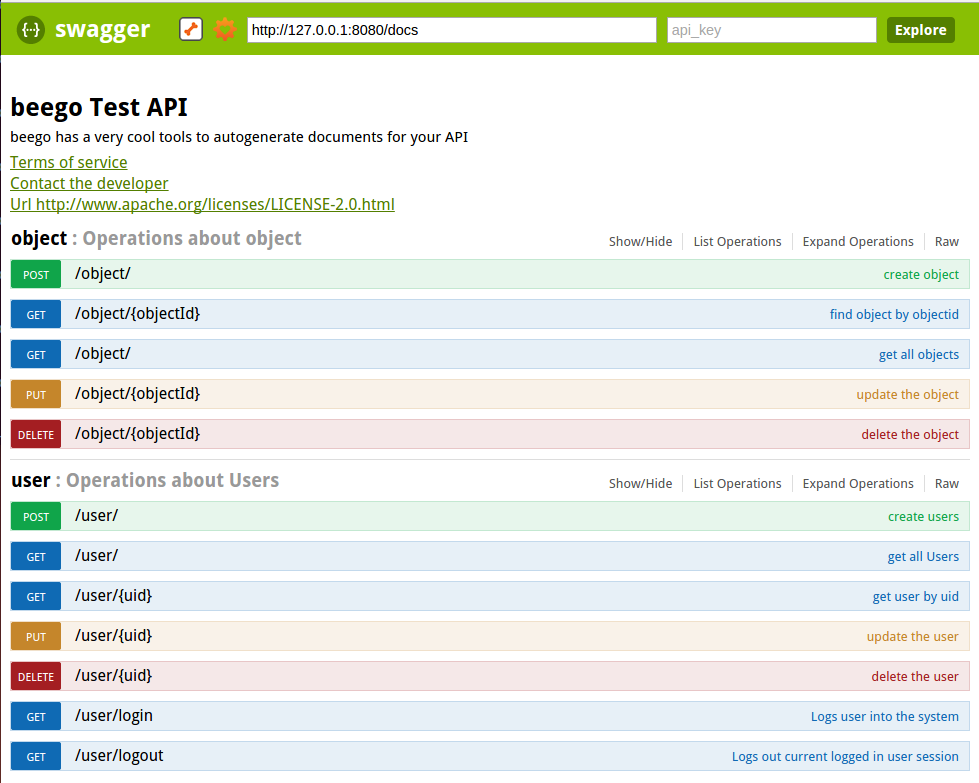

# 15.2 beego API开发以及自动化文档

beego API项目通过swagger生成可以方便的查看API的文档，同时使用API的用户可以直接通过swagger进行请求和获取结果。通过根据go源码生成swagger标准的json格式，就可以和swagger完美结合了。这样做的好处有三个：  
	1. 注释标准化  
	2. 有了注释之后，以后API代码维护相当方便  
	3. 根据注释自动化生成文档，方便调用的用户查看和测试  

## beego API应用入门

首先进入到你的$GOPATH/src目录，执行命令`bee api bapi`,进入目录`cd bapi`,执行命令`bee run -downdoc=true -gendoc=true`.执行完成之后就打开浏览器，输入URL:http://127.0.0.1:8080/swagger/swagger-1/，则执行效果如下所示

